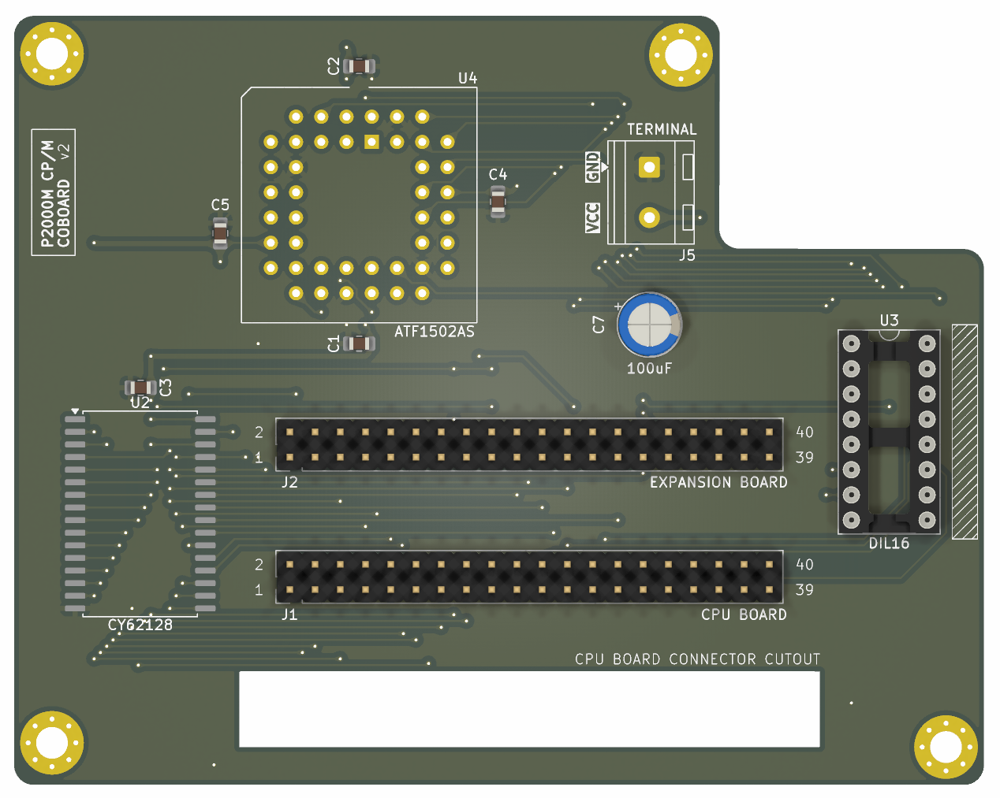
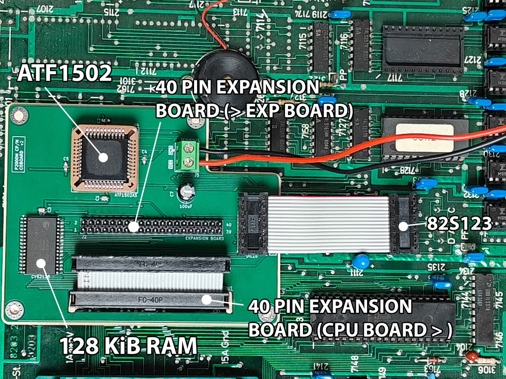
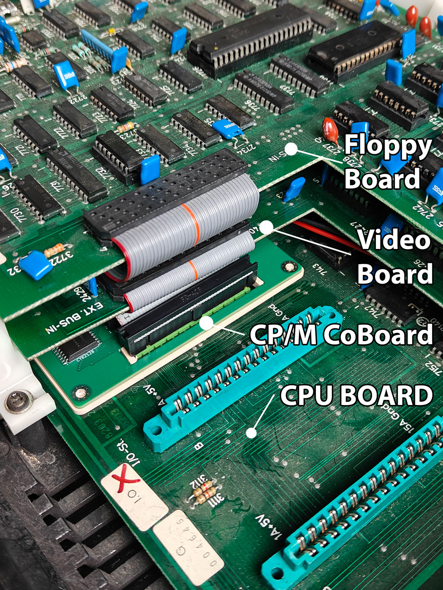

# P2000M CP/M co-board

This board adds the memory mapping and local RAM needed to run CP/M on a
Philips P2000M. It sits between the P2000M CPU board and its expansion board,
while also replacing the motherboard's 82S123 address-decoder PROM.

## Features

The CP/M co-board combines the decoder replacement and CP/M memory mapper in one
compact board:

- An ATF1502AS CPLD recreates the stock P2000M decoding after reset and changes
  to the CP/M map when software writes `80h` to an I/O port in `20h`–`2Fh`.
- A 128 KiB CY62128 SRAM provides a fixed 16 KiB bank for CP/M plus seven
  switchable 16 KiB banks, accessible through an optional window at `4000–7FFF`.
  The default mapping preserves the existing boot path. Using the extra 112 KiB
  requires bank-aware software. CPLD revision 0.6 has a banked-video overlap;
  the attempted revision 0.7 correction fails to boot on hardware. Use 0.6
  for ordinary CP/M operation with banking disabled pending investigation.
- Two 40-pin connectors pass the CPU-board and expansion-board buses through
  the co-board. The 16-pin plug replaces the motherboard's 82S123 PROM.
- The CPLD's JTAG pins remain available for programming. The terminal provides
  an accessible +5 V and ground connection.

In CP/M mode, the address space is arranged as follows:

| Address range | Function |
| --- | --- |
| `0000`–`3FFF` | Motherboard RAM |
| `4000`–`7FFF` | Expansion RAM, or selected co-board SRAM bank 1–7 |
| `8000`–`9FFF` | Expansion RAM |
| `A000`–`DFFF` | Co-board SRAM, fixed bank 0 |
| `E000`–`EFFF` | CP/M cartridge BIOS slice |
| `F000`–`FFFF` | Video and attributes |

The CPLD observes CPU memory and I/O cycles and drives the same select signals
that the original PROM generated. At reset it uses the normal P2000M layout.
The CP/M bootstrap switches the mapping, redirects the RAM windows, selects the
local SRAM, and translates the upper expansion address bits for the video
window. The original map can be restored by writing `00h` to the same port
range.

Bank selection uses a single `OUT (20h),A` instruction, with no additional
wiring. See the [bank-control interface and examples](cupl/README.md#atomic-bank-switching).

The large opening below the CPU-board connector is intentional. It clears the
P2000M CPU board's mating connector and its surrounding hardware, so the
co-board can sit in the available space without loading or obstructing it.

## Installation

Work with the P2000M powered off. Remove the original 82S123 PROM, install the
co-board's 16-pin plug in that PROM socket with pin 1 correctly aligned, then
connect the CPU-board and expansion-board 40-pin headers to their matching
co-board connectors. The board bridges those two layers: the CPU board is below
it and the expansion board is above it.

<table>
  <tr>
    <td width="50%"> <em>Top view: co-board installed between the CPU and expansion boards.</em></td>
    <td width="50%"> <em>Side view: CPU board at the bottom, CP/M co-board in the middle, and the video/floppy expansion boards above.</em></td>
  </tr>
</table>

Program the CPLD with [`cupl/p2000m-cpm-coboard.jed`](cupl/p2000m-cpm-coboard.jed).
The stock-only image is useful for checking the installation, but it cannot
enable CP/M. Build and programming-file details are in [the CPLD
documentation](cupl/README.md). The CP/M cartridge and disk images are in
[`software`](software).

## Licence

The revised co-board hardware design and its associated CPLD source are
released under the [CERN Open Hardware Licence Version 2 — Permissive
(CERN-OHL-P-2.0)](https://ohwr.org/cern_ohl_p_v2.txt). You may use, study,
modify, manufacture, distribute, and sell designs and products based on this
work under the licence terms. The licence is deliberately permissive: derivative
hardware does not have to be released under the same licence.

Files that identify another licence, and third-party or historical materials in
`literature`, retain their own terms.
