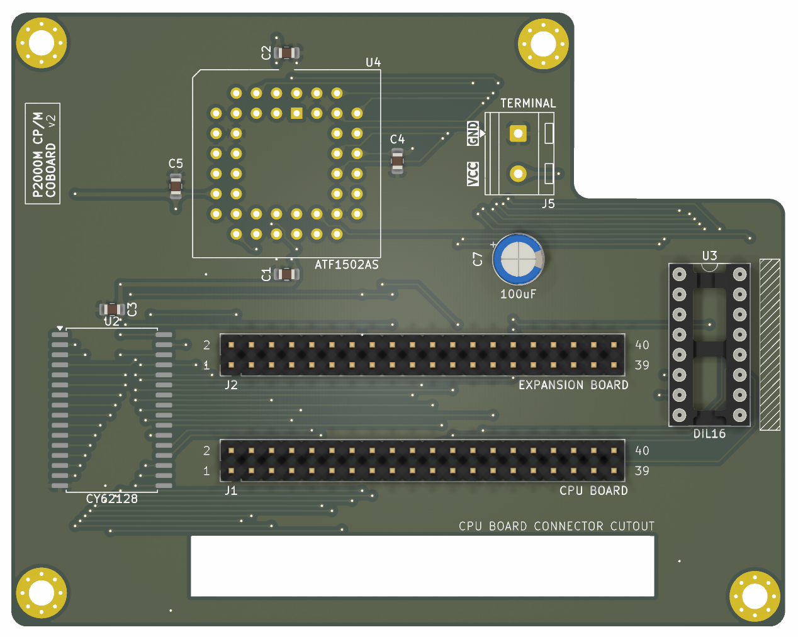
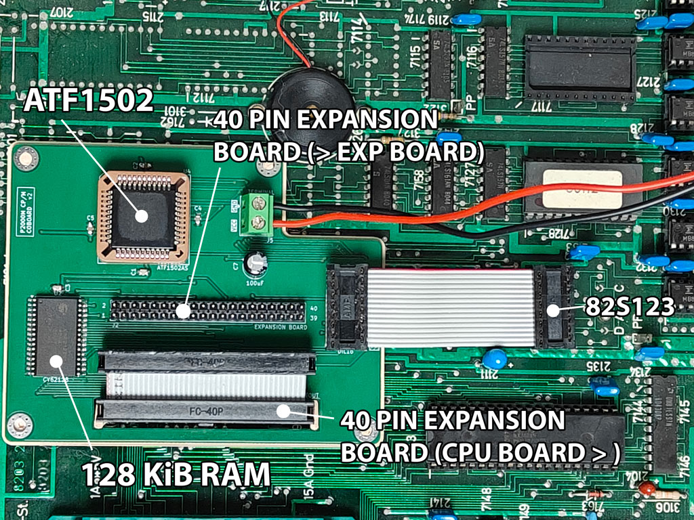
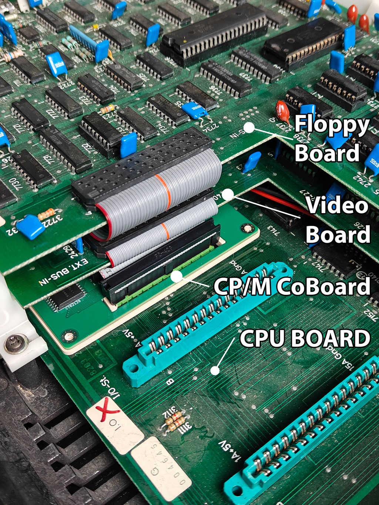

# P2000M CP/M co-board

This board adds the memory mapping and local RAM needed to run CP/M on a
Philips P2000M. It sits between the CPU board and the video expansion board
and replaces the motherboard's 82S123 address-decoder PROM.

## Features

- An ATF1502AS CPLD recreates the stock P2000M decode after reset and switches
  to the CP/M map when software writes `80h` to a port in `20h`-`2Fh`.
- A 128 KiB CY62128 SRAM supplies the fixed 16 KiB CP/M bank and seven optional
  16 KiB banks. The tested CUPL implementation supports the complete banked
  interface described below.
- The two 40-pin connectors pass the CPU and video-expansion buses through the
  co-board. The 16-pin plug replaces the motherboard's 82S123 PROM.
- The CPLD's JTAG pins remain available for programming.

The normal CP/M map is:

| Address range | Function |
| --- | --- |
| `0000`-`3FFF` | Motherboard RAM |
| `4000`-`9FFF` | 24 KiB RAM on the floppy-controller board |
| `A000`-`DFFF` | Co-board SRAM, fixed bank 0 |
| `E000`-`EFFF` | CP/M cartridge BIOS slice |
| `F000`-`FFFF` | Video and attributes |

The opening below the CPU-board connector clears the mating connector and
surrounding hardware, allowing the co-board to fit in the existing stack.

## Installation

Work with the P2000M powered off. Remove the original 82S123 PROM and install
the co-board's 16-pin plug in that socket with pin 1 correctly aligned. Connect
the CPU-board and video-expansion-board headers to their matching co-board
connectors.

<table>
  <tr>
    <td width="50%"> <em>Top view of the installed co-board.</em></td>
    <td width="50%"> <em>Side view of the board stack.</em></td>
  </tr>
</table>

Program the CPLD with the tested
[`cupl/p2000m-cpm-coboard.jed`](cupl/p2000m-cpm-coboard.jed). Its matching
source is [`cupl/p2000m-cpm-coboard.pld`](cupl/p2000m-cpm-coboard.pld).
Programming and verification details are in [`cupl/README.md`](cupl/README.md).
The CP/M cartridge and disk images are in [`software`](software).

> [!NOTE]
> The open-source [ATF150x Programmer](https://github.com/ifilot/atf150x-programmer)
> can flash the CPLD without the comparatively expensive proprietary programmer.

## Systems without the floppy-controller board

The optional `no-floppy` CUPL variant replaces the absent board's 24 KiB RAM
during CP/M operation. It is intended only for a machine in which the complete
floppy-controller board is physically absent. It does not emulate the floppy
controller or provide disk storage.

That variant allocates onboard SRAM as follows:

| SRAM bank | Use |
| --- | --- |
| 0 | Fixed CP/M RAM at `A000`-`DFFF` |
| 1 | Replacement RAM at `4000`-`7FFF` |
| 2, lower 8 KiB | Replacement RAM at `8000`-`9FFF` |
| 3-7 | Optional 16 KiB banks at `4000`-`7FFF` |

It therefore exposes five optional banks rather than seven. This variant only
replaces RAM in CP/M mode; it does not provide the stock-map expansion RAM at
`A000`-`FFFF`. See [`cupl/README.md`](cupl/README.md) before using it.

The compiled [`p2000m-cpm-coboard-no-floppy.jed`](cupl/p2000m-cpm-coboard-no-floppy.jed)
is included because building it requires WinCUPL. It has passed source
verification and ATF1502AS fitting, but still requires testing on physical
hardware.

## Licence

The canonical co-board hardware and associated CUPL source are released under
the [CERN Open Hardware Licence Version 2 — Permissive
(CERN-OHL-P-2.0)](https://ohwr.org/cern_ohl_p_v2.txt).

Files that identify another licence, and third-party or historical materials
under `literature` and `archive`, retain their own terms.
